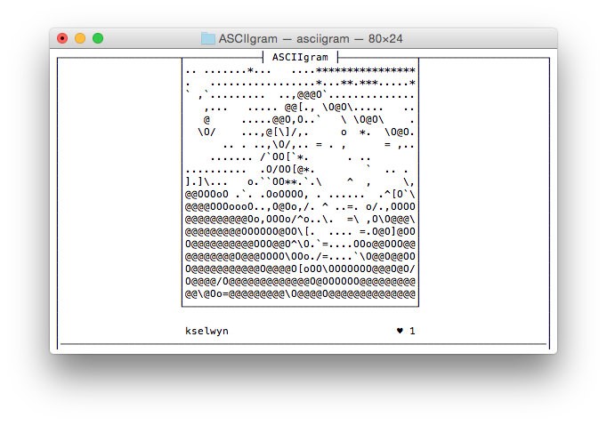

> :warning: **The Instagram Legacy API [was disabled](https://www.instagram.com/developer/) on June 29, 2020.** There is no guarantee this program will work with the new/updated API.

# ASCIIgram

Inconvenient Instagram CLI

## Explanation

Have you ever wanted to view Intagram in your terminal, complete with ASCII approximations of the images? Too bad. Here's the program.



## Installation

```bash
make && sudo make install
```

By default, this program uses `open` to open URLs on Mac and `xdg-open` on Linux. To set a custom URL opener action, set that macro in `gcc`, making sure to Make sure to double quote and double excape:

```bash
gcc -o asciigram asciigram.c ... -D_OPEN='"/Applications/Google\\ Chrome.app/Contents/MacOS/Google\\ Chrome"'
```

Note: This program depends on curses, libcurl, jansson, and libjpeg

## Usage

```bash
Usage: asciigram --client_id="<id>" --client_secret="<secret>"
```

To get a `client_id` and `client_secret`, go to [https://instagram.com/developer/](https://instagram.com/developer/) to register a new application. Make sure to set `http://localhost:1337/` as one of the Redirect URI(s).

## Controls

| Key          | Action         |
|--------------|----------------|
| `UP ARROW`   | Previous photo |
| `DOWN ARROW` | Next photo     |
| `o`          | Open photo     |
| `q`          | Quit program   |

## Acknowledgements

Credit to Instagram because this breaks some rules. Namely the name (including `gram`) and the fact that it slightly (and terribly) replicates the core user experience of Instagram.
